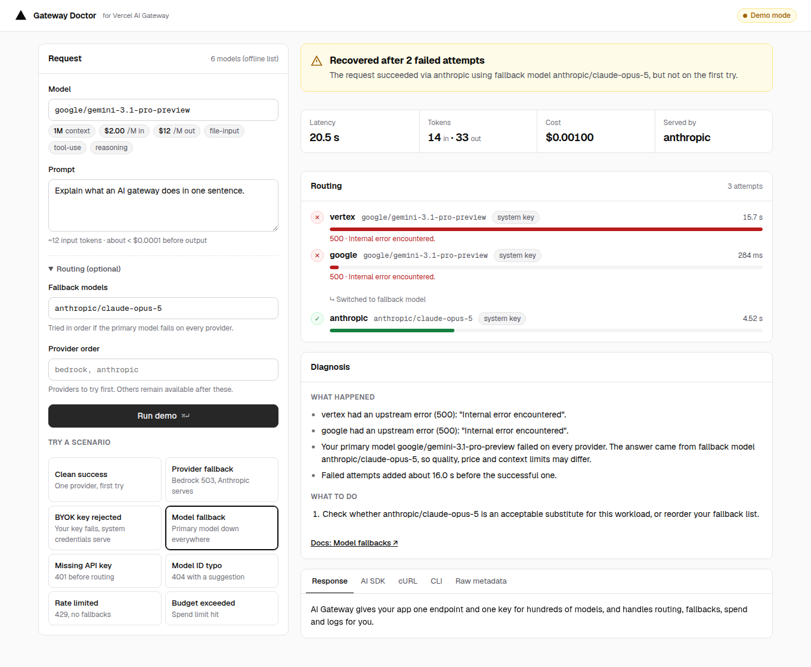
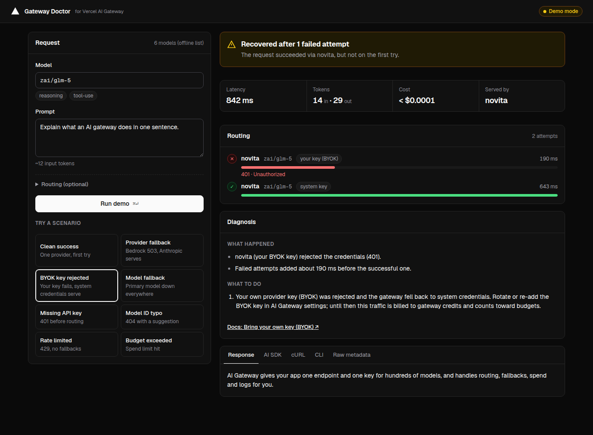
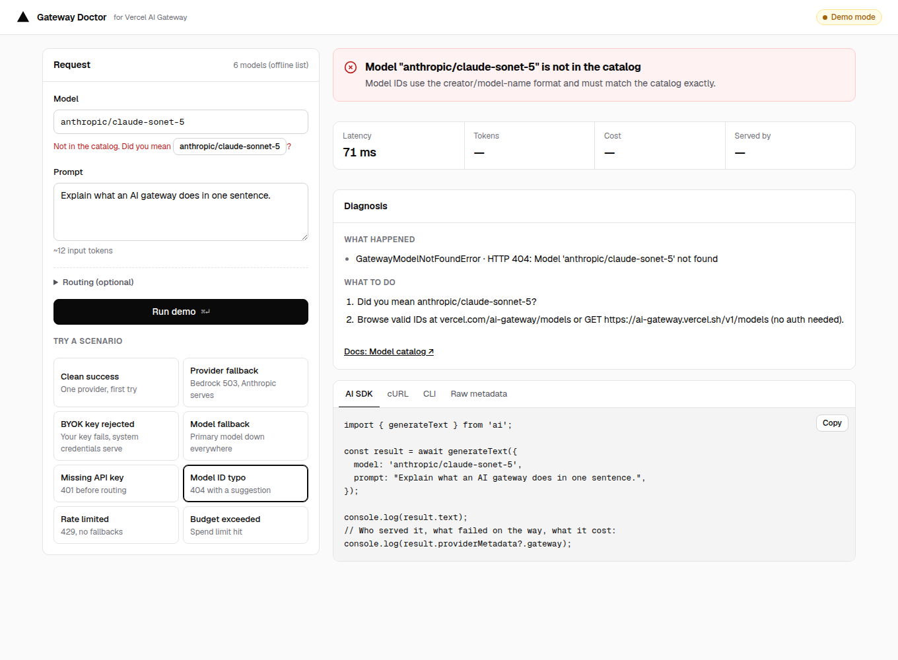
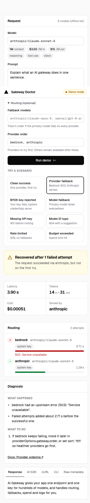

# Gateway Doctor

**Send a request through Vercel AI Gateway and see exactly what happened:** which provider served it, what failed on the way, what it cost, and what to change. It runs in the browser and in the terminal.



Built with Next.js 16, React 19, TypeScript, AI SDK 7 and AI Gateway.

---

## The problem I noticed

AI Gateway fails over quietly. That is the point of it, but it also means a request can "succeed" while something important went wrong:

- Your primary provider returned 503s and every request paid a **~3 s latency tax** before the fallback answered.
- Your primary model was down everywhere, and a **different model** answered, with different quality, price and context limits.
- Your **own provider key (BYOK) was rejected**, so traffic went to system credentials and now **counts toward your gateway budget**.

The facts are all in `providerMetadata.gateway.routing`, but they come as a nested JSON object. When a request fails outright, the error names a class (`GatewayAuthenticationError`) but does not tell you what to do next.

**Goal:** a developer should understand any single request in about 10 seconds, and know the next step without reading docs first.

## What I designed

| Decision | Why |
|---|---|
| **Three verdicts: OK / Recovered / Failed** | "Recovered" is the state that matters most and is hardest to see. Giving it its own color and headline stops it from looking like "OK". |
| **Routing timeline** with a bar per attempt, scaled by duration | Shows at a glance *where the time went*. A 15.7 s red bar next to a 4.5 s green one explains a slow request better than a paragraph could. |
| **"What happened" → "What to do" → one docs link** | Findings are facts; fixes are actions. Keeping them apart makes each one quick to scan. Each failure type points to *one* relevant doc page. |
| **Catch mistakes before the request is sent** | The most common first-request failure is a mistyped model ID. The form checks the ID against the public catalog as you type and offers a one-click "Did you mean…". |
| **Same request in AI SDK, cURL and CLI** | Developers debug where they already are. The inspector's Code tab reproduces the exact request, routing options included, so there is nothing to translate. |
| **Demo scenarios** | The failure paths are rare and hard to trigger on purpose. Eight scenarios built from documented metadata shapes make every state reproducible for reviews and tests, and let anyone try the app without an API key. |
| **Model facts next to the input** | Context size, $/M tokens and capability tags show up as soon as you pick a model, along with a rough input-cost estimate. That answers "choose the right model" before you spend a request on it. |

## What I built

```
lib/diagnose.ts   Pure diagnosis engine: metadata/error → verdict, findings, fixes
lib/run.ts        One runner (generateText + AI Gateway) shared by the UI and the CLI
lib/fixtures.ts   8 demo scenarios based on the documented metadata shapes
lib/snippet.ts    Reproducible AI SDK / cURL / CLI snippets
app/api/run       Validates input per field, then calls the runner
components/       Request form + Inspector (verdict, stats, timeline, diagnosis, code tabs)
cli/doctor.ts     Same diagnosis in the terminal, --json for scripts, exit codes 0/1/2
```

**Details I paid attention to**

- **Accessibility:** a labeled form with errors tied to their fields (`aria-describedby`), a live region for model info, `role="status"` for the verdict, arrow-key tabs, a skip link, visible focus, and slower animation under `prefers-reduced-motion`.
- **Resilience:** if the catalog can't be fetched, the app uses a bundled list. Validation errors appear next to the field that caused them, not as a generic toast. The metadata parser treats every field as optional, since the gateway adds fields over time.
- **Honest numbers:** `maxRetries: 0`, so SDK retries can't hide the gateway's first failure. The duration parser handles both timing formats the gateway returns (`responseTimeMs` and `startTime`/`endTime`).
- **Light and dark themes** built on shared color tokens, with a layout that stacks on phones.
- **Tests** (`npm test`) cover every scenario and check typo suggestions, both timing formats and the snippet output.

## What I learned / what I'd do next

- **The "Recovered" state deserves product surface.** In AI Gateway's dashboard I'd suggest a *"recovered requests"* filter and a weekly "failover tax" figure (latency added and spend moved to fallbacks).
- **BYOK fallback has a billing side effect** that users may not expect. It deserves a warning where the key is configured, not only in the logs.
- **Next:** look up past requests by `generationId` through the Generation Lookup API, add a batch mode that runs N requests and summarizes failover rates per provider, and add a "diagnose" link from request logs.

---

## Run it

```bash
npm install
cp .env.example .env.local     # optional: add AI_GATEWAY_API_KEY for live requests
npm run dev                    # http://localhost:3000
```

Without a key the app runs in **demo mode** with the scenarios. With a key, requests go live, and the scenarios stay available for replay.

### CLI

```bash
npx tsx cli/doctor.ts "Explain AI Gateway" --model anthropic/claude-sonnet-5
npx tsx cli/doctor.ts "Hi" --model google/gemini-3.1-pro-preview --fallback anthropic/claude-opus-5
npx tsx cli/doctor.ts "Hi" --scenario byok-fallback
npx tsx cli/doctor.ts "Hi" --json | jq .diagnosis
```

Exit codes: `0` ok, `1` recovered, `2` failed, so you can use it as a smoke test in CI.

### Deploy

```bash
npx vercel            # on Vercel, OIDC authenticates AI Gateway without a key
```

## Screenshots

| Recovered via BYOK fallback (dark) | Typo caught before sending | Mobile |
|---|---|---|
|  |  |  |
